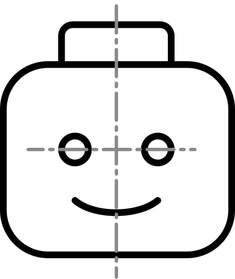

# legoman



Simple static website generator.

Supports TOC, image captions, LaTeX, code highlighting and tables.

[Demo](http://evanw.org)

# Usage

``` bash
pip install legoman

# in an empty directory
legoman init
make html

# run devserver (requires inotify-tools)
make devserver
```

# How it works

- `.md` files are rendered using the template specified in their frontmatter
- `.j2` files are rendered with Jinja2. They can loop over `.md` files and access their metadata
- all other files are symlinked to `output/`

For example, the demo `content/`:
```
content
├── codehilite.css
├── index.j2
├── projects
│   ├── bar_proj
│   │   └── index.md
│   └── foo_proj
│       ├── cheetos_small.png
│       └── index.md
└── styles.css
```

yields this `output/`
```
output
├── codehilite.css
├── index.html
├── projects
│   ├── bar_proj
│   │   └── index.html
│   └── foo_proj
│       ├── cheetos_small.png
│       └── index.html
└── styles.css
```

# See also
- [Hugo](https://github.com/gohugoio/hugo) - similar idea, but written in Go and uses Go's templating engine
- [Dozens of other static website generators](https://www.staticgen.com/)
